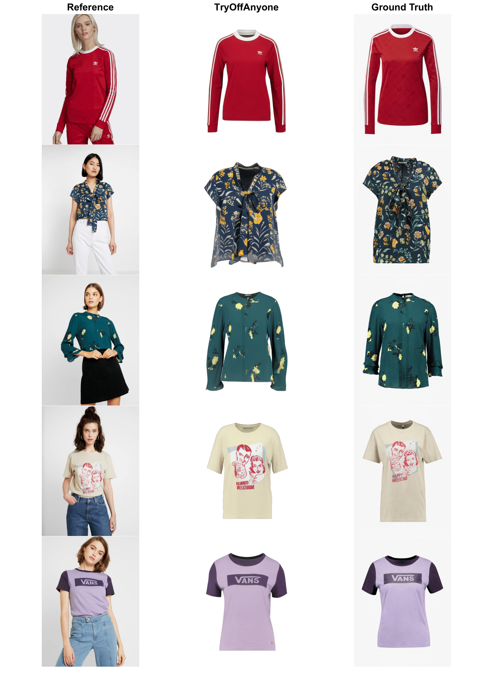

# TryOffAnyone



The official repository of the paper: _"TryOffAnyone: Tiled Cloth Generation from a Dressed Person"_.

[![arXiv][logo-paper]][paper-arxiv]
[![Generic badge][logo-hf_models]][hf_models]
[![Generic badge][logo-hf_spaces]][hf_spaces]

### Install
Clone the repository, install the required packages:
```
git clone https://github.com/ixarchakos/try-off-anyone.git
cd try-off-anyone
python3 -m pip install -r requirements.txt
```

Download the model from:
- https://huggingface.co/ixarchakos/tryOffAnyone

in `"try-off-anyone/ckpt/"`

The provided model only works for upper clothes similar to the ones in VITON-HD

### Mac Users
Change in config.py
```
device = 'mps'
```

### Inference
Execute TryOffAnyone on any image url
```
python3 main.py --inference --url="https://cdn11.bigcommerce.com/s-405b0/images/stencil/590x590/products/97/20409/8000-gildan-tee-t-shirt.ca-model__66081.1724276210.jpg"
```

the output is saved in `"try-off-anyone/data/"`

### Evaluation on VITON-HD

#### Dataset
- Download the original VITON-HD dataset 

and extract it to `"try-off-anyone/data/"`

- Download the cloth image masks from:
https://huggingface.co/ixarchakos/tryOffAnyone/blob/main/masks.zip

and save them in `"try-off-anyone/data/zalando-hd-resized/test/"`

#### Evaluation

Evaluate TryOffAnyone on VITON-HD:
```bash
python3 main.py --test
```


### Citation
If you find this repository useful in your research, please consider giving a star ⭐ and a citation:
```
@misc{xarchakos2024tryoffanyonetiledclothgeneration,
      title={TryOffAnyone: Tiled Cloth Generation from a Dressed Person}, 
      author={Ioannis Xarchakos and Theodoros Koukopoulos},
      year={2024},
      eprint={2412.08573},
      archivePrefix={arXiv},
      primaryClass={cs.CV},
      url={https://arxiv.org/abs/2412.08573}, 
}
```

[logo-hf_models]: https://img.shields.io/badge/🤗-Models-blue.svg?style=plastic
[logo-hf_spaces]: https://img.shields.io/badge/🤗-Demo-blue.svg?style=plastic
[logo-paper]: https://img.shields.io/badge/arXiv-Paper-b31b1b.svg?style=plastic
[hf_datasets]: https://huggingface.co/datasets/rizavelioglu/...
[hf_spaces]: https://huggingface.co/spaces/ixarchakos/TryOffAnyone
[hf_models]: https://huggingface.co/ixarchakos/tryOffAnyone
[paper-arxiv]: https://arxiv.org/pdf/2412.08573
